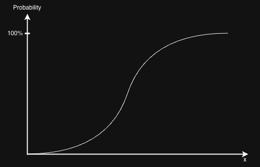

# Exergy - Ore Grade Decrease Modeling

## Background
This work started by investigating the possibility of measuring the dissipation in LCA using exergy, specifically with the idea of thermodynamic rarity (TheRy), a concept developed by Antonio Valero and Alicia Valero. However, the TheRy model assumes all the dissipated resources go immediately to a concentration of the dead state seeing it in a very long time horizon. This is makes it difficult to quantify the short term impact of the life cycle of a product on the aspect of resource use accurately. 

Therefore, the new attempt is to describe the impact of gradual resource dissipation of a product system in terms of exergy. To demonstrate the gradual resource dissipation process, the idea of ore-grade decrease is incorporated. The mathematical equation used to calculated the ERC in the previous work can be applied here to develop characterization factor (CF) for a smaller variation of ore grade. 

## Outline
Current work can be separated into 3 parts:
1. Modelling ore-grade decrease: this describes the relationship between the ore-grade and the amount of ore that is extracted (also called tonnage)
2. Corresponding exergy burden added to the future generation due to the change in ore concentration
3. Taking into account the concept of dissipation by considering the ratio between the dissipated resources versus the amount of extracted resources.

### Part 1: Ore-grade decrease modelling
Originally, ore-grade decrease was modelled with the Lasky’s relationship that connects the ore-grade (g) and the tonnage of rocks mined (T).  
$g=a-b\ln(T)$,  
where a and b are constants that differ from mineral to mineral. 
The choice of model was updated to the log-logistic distribution in the recent study by Vieira et al. 
#### Original log-logistic distribution, F(x)
$F(x)=\frac{1}{1+(\frac{x}{a})^{-b}}$

#### Adapted for distribution of ore-grade, H(g)
$H(g)=1-F(g)=1-\frac{1}{1+(\frac{x}{a})^{-b}}=\frac{1}{1+(\frac{x}{a})^b}$  
It is expressed in this form in the paper of Vieira:  
$H(g)=\frac{1}{1+e^{\frac{\ln(g)-\alpha}{\beta}}}$  

##### Derivation 
$\frac{x}{a}^b$
$=e^{\ln(\frac{x}{a})^b}$
$=e^{b\ln(\frac{x}{a})}$
$=e^{b(\ln{x}-\ln{a})}$  
let $\alpha=\ln{a}$;
let $\beta=\frac{1}{b}$  
$=e^{\frac{\ln(g)-\alpha}{\beta}}$  

To find the cumulative metal tonnage (CMT), we just have to multiply the ore-grade (g), with the ultimate amount of reserve (A):  
$CMT=\frac{A}{1+e^{\frac{\ln(g)-\alpha}{\beta}}}$,  
Here, $\alpha$ represents the natural logarithm of the median ore grade, and $\beta$ is the scale parameter, which tells how spread out is the concentration data from the median, $e^{\alpha}$.  
This statistical model better captures the global ore-grade vs. tonnage data. 

##### Region 1
Region 1 represents the early stage of mining, where most of the ores have high concentration. This is where the independent variable, g, is high, and the dependent variable, CMT, is relatively low. 
##### Region 2
Region 2 has the quickest ore-grade decline, with an almost steep linear relationship between the ore-grade and the CMT. 
##### Region 3
Region 3 is the scenario where the ore grade has become really low and CMT is really high. This models very well the reality of the high effort that needs to be invested in order to get the same amount of 

### Part 2: Connect ore-grade decrease with exergy
Given calculation of ERC in the framework of TheRy, we can calculate the small extra exergy by considering the starting mine concentration point x_m assumed in the paper of Magdalena and the change in ore grade computed in Part 1. 

### Part 3: Adding the concept of dissipation
As of now, the dissipation is thought to be modelled using yearly dissipation data/yearly extraction data, which is a difficult step to realize, because one needs to consider the annual data in 
